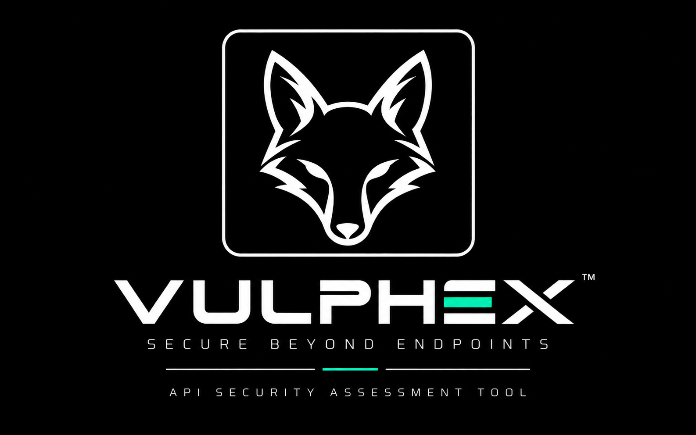

# VULPHEX

<p align="center">
  
</p>

<p align="center">
  <strong>Secure Beyond Endpoints</strong><br>
  API Security Assessment Tool
</p>

---

## Problem

Modern applications rely heavily on APIs to expose data and application functionality. Weak authentication, broken authorization, unsafe input handling, injection vulnerabilities, excessive data exposure, insecure security configuration, and insufficient rate limiting can introduce significant security risks.

Manual API security testing can also become repetitive when the same baseline checks must be performed across multiple endpoints.

VULPHEX addresses this by providing a controlled, CLI-based API security assessment workflow that can discover API endpoints, execute bounded security checks, analyze observed behavior, and produce evidence-based assessment results.

---

## Solution

**VULPHEX** is a command-line API Security Assessment Tool designed for **authorized security testing**.

It combines:

- API discovery
- Endpoint-aware security testing
- Authentication and authorization assessment
- Evidence collection
- Finding aggregation
- Severity classification
- Terminal output
- JSON, HTML, and PDF reporting

VULPHEX focuses on controlled security validation rather than destructive exploitation. Security tests use bounded requests and conservative detection logic so results can be reviewed and reproduced by a security tester.

---

## Key Features

### API Discovery
- OpenAPI / Swagger discovery
- Endpoint inventory
- HTTP method and endpoint context
- Schema-aware endpoint analysis

### Authentication & Authorization
- Missing authentication assessment
- Authentication scheme analysis
- BOLA testing with explicit test context
- BFLA testing with explicit authorization context

### Input & Injection Security
- API input validation testing
- Controlled SQL injection testing
- Controlled NoSQL injection testing
- Controlled OS command injection testing

### Data & Information Security
- Sensitive data exposure detection
- Error and information disclosure detection

### Security Configuration
- Rate-limiting assessment
- CORS and security configuration assessment
- API misconfiguration assessment

### Assessment & Reporting
- Evidence-based finding aggregation
- Severity classification
- Terminal output
- JSON reports
- HTML reports
- PDF reports
- Interactive CLI shell

### Platform & Development
- Windows launcher
- Linux / Unix launcher
- Automated regression test suite

---

## Architecture

```text
                         ┌──────────────────────┐
                         │     VULPHEX CLI      │
                         │    Windows / Linux   │
                         └──────────┬───────────┘
                                    │
                                    ▼
                         ┌──────────────────────┐
                         │  Discovery Engine    │
                         │  OpenAPI / Swagger   │
                         └──────────┬───────────┘
                                    │
                                    ▼
                         ┌──────────────────────┐
                         │  Assessment Engine   │
                         │   Endpoint Context   │
                         └──────────┬───────────┘
                                    │
              ┌─────────────────────┼─────────────────────┐
              │                     │                     │
              ▼                     ▼                     ▼
      ┌───────────────┐     ┌───────────────┐     ┌────────────────┐
      │Authentication │     │ Authorization │     │ Security Tests│
      │  & Metadata   │     │   BOLA/BFLA   │     │ Input/Injection│
      └───────────────┘     └───────────────┘     │ Data/Config    │
                                                   └───────┬────────┘
                                                           │
                                                           ▼
                                               ┌──────────────────────┐
                                               │  Finding Aggregator  │
                                               │ Evidence & Severity   │
                                               └──────────┬───────────┘
                                                          │
                                                          ▼
                                               ┌──────────────────────┐
                                               │ Output & Reporting   │
                                               │ CLI / JSON / HTML /  │
                                               │ PDF                  │
                                               └──────────────────────┘
```

---

## Technology Stack

| Component | Technology |
|---|---|
| Language | Python 3.13+ |
| CLI | Typer |
| HTTP Client | HTTPX |
| API Specification | OpenAPI / Swagger |
| Configuration | YAML / Environment Variables |
| Testing | pytest |
| Terminal Output | Rich |
| Reporting | JSON / HTML / ReportLab PDF |
| Packaging | `pyproject.toml` |
| Platforms | Windows / Linux / Unix-like systems |

---

## Installation

VULPHEX uses a private Python runtime inside `.venv`. Users **do not need to activate the virtual environment manually**.

### Linux / Unix

Clone the repository:

```bash
git clone <YOUR_REPOSITORY_URL>
cd VULPHEX
```

Run the installer:

```bash
chmod +x install.sh vulphex
./install.sh
```

Launch VULPHEX:

```bash
./vulphex --help
```

### Windows PowerShell

Clone the repository:

```powershell
git clone <YOUR_REPOSITORY_URL>
cd VULPHEX
```

Run the installer:

```powershell
.\install.ps1
```

Launch VULPHEX:

```powershell
.\vulphex.ps1 --help
```

### Requirements

- Python 3.13 or newer
- Network access for package installation
- An authorized API target for security assessment

---

## Configuration

VULPHEX supports explicit authentication and authorization assessment contexts.

Authentication is intentionally **opt-in**. Credentials, tokens, and other sensitive values should be supplied through the supported configuration mechanisms rather than hard-coded into source code.

### Supported Authentication Modes

- No authentication
- Bearer authentication
- API key authentication
- Custom header authentication

Authorization tests such as BOLA and BFLA require explicit test context. VULPHEX does not infer user roles or silently create authorization identities.

View the available options with:

```bash
./vulphex --help
```

---

## How to Run

### Show Help

Linux:

```bash
./vulphex --help
```

Windows:

```powershell
.\vulphex.ps1 --help
```

### Show Version

```bash
./vulphex --version
```

### Discover OpenAPI / Swagger

```bash
./vulphex --url https://example.com --parse
```

Short option:

```bash
./vulphex --url https://example.com -p
```

Discovery checks supported OpenAPI / Swagger locations and displays the discovered endpoint inventory.

### Run Security Assessment

Run the complete security assessment:

```bash
./vulphex --url https://example.com --security-all
```

### Run Individual Security Tests

VULPHEX supports individual security assessments using either the full option name or its short alias.

| Security Test | Full Option | Short | Example |
|---|---|---|---|
| Missing Authentication | `--missing-authentication` | `-m` | `./vulphex --url https://example.com -m` |
| Authentication Scheme Analysis | `--auth-scheme` | `-A` | `./vulphex --url https://example.com -A` |
| BOLA | `--bola` | `-o` | `./vulphex --url https://example.com -o` |
| BFLA | `--bfla` | `-f` | `./vulphex --url https://example.com -f` |
| Input Validation | `--input-validation` | `-v` | `./vulphex --url https://example.com -v` |
| SQL Injection | `--sql-injection` | `-s` | `./vulphex --url https://example.com -s` |
| NoSQL Injection | `--nosql-injection` | `-n` | `./vulphex --url https://example.com -n` |
| OS Command Injection | `--command-injection` | `-c` | `./vulphex --url https://example.com -c` |
| Sensitive Data Exposure | `--data-exposure` | `-d` | `./vulphex --url https://example.com -d` |
| Error & Information Disclosure | `--error-disclosure` | `-e` | `./vulphex --url https://example.com -e` |
| Rate Limiting | `--rate-limiting` | `-l` | `./vulphex --url https://example.com -l` |
| Security Configuration | `--security-configuration` | `-q` | `./vulphex --url https://example.com -q` |
| API Misconfiguration | `--api-misconfiguration` | `-M` | `./vulphex --url https://example.com -M` |

### Aggregate Assessments

| Assessment | Full Option | Short | Description |
|---|---|---|---|
| All Authentication Tests | `--all` | `-a` | Run all authentication-related assessments |
| All Authorization Tests | `--all-authorization` | `-z` | Run BOLA and BFLA authorization assessments |
| All Security Tests | `--security-all` | — | Run the complete security assessment |

### API Discovery

| Function | Full Option | Short | Description |
|---|---|---|---|
| OpenAPI / Swagger Discovery | `--parse` | `-p` | Discover and display the target API endpoint inventory |

### Generate Reports

JSON:

```bash
./vulphex --url https://example.com --security-all --json
```

HTML:

```bash
./vulphex --url https://example.com --security-all --html
```

PDF:

```bash
./vulphex --url https://example.com --security-all --pdf
```

Generated assessment output is runtime data and is intentionally not stored in the source repository.

### Interactive Shell

Run VULPHEX without arguments:

```bash
./vulphex
```

The interactive shell accepts the same VULPHEX option names and short aliases as direct CLI execution.

Shell-only commands:

```text
help
banner
clear
exit
quit
```

---

## How to Test

VULPHEX includes an automated regression test suite.

Run:

```bash
python -m pytest
```

The test suite covers:

- API discovery
- Assessment engine
- Authentication
- Authorization
- SQL injection
- NoSQL injection
- Command injection
- Input validation
- Sensitive data exposure
- Information disclosure
- Rate limiting
- Security configuration
- API misconfiguration
- Reporting
- CLI behavior

Run the test suite after changes to the assessment engine, security tests, CLI, or reporting components to detect regressions.

---

## Authorized Test Environment

VULPHEX is intended for **authorized security testing only**.

Validation should begin against a controlled test API containing known secure, vulnerable, and edge-case behaviors. This provides a reproducible environment for validating detection logic without affecting third-party systems.

After controlled validation, VULPHEX may be used against real applications only when explicit authorization exists and the target is within the applicable Rules of Engagement, Vulnerability Disclosure Program, or bug bounty scope.

Appropriate environments include:

- Locally hosted vulnerable APIs
- Dedicated security testing environments
- Internal applications with explicit authorization
- Vulnerability Disclosure Programs
- Bug bounty programs where API testing is explicitly permitted

> **Do not use VULPHEX against systems outside your authorized scope.**

---

## Security Considerations

VULPHEX is intentionally designed around bounded and controlled testing.

### Safety Controls

- No destructive exploitation
- No credential theft
- No real-world brute-force attacks
- No denial-of-service or stress testing
- No unrestricted endpoint fuzzing
- No database extraction
- No reverse shells or command execution
- No unauthorized target testing
- Explicit authentication configuration
- Sanitized evidence and sensitive-value redaction
- Conservative vulnerability classification
- Endpoint and method applicability checks
- Request limits for security tests
- No hard-coded credentials or secrets

Some findings may be reported as **potential** or **indicated** when the available evidence does not justify claiming confirmed exploitation.

Security findings should therefore be manually validated by the tester before being treated as confirmed vulnerabilities.

---

## Future Improvements

Potential future improvements include:

- Broader API discovery capabilities
- Additional authentication mechanisms
- OAuth / OIDC security testing
- Expanded authorization testing workflows
- Additional API injection and parser-specific checks
- More schema-aware test generation
- Improved evidence normalization
- Additional report formats
- Configurable assessment profiles
- Expanded regression-test coverage
- Safe support for additional HTTP methods where appropriate
- Improved integration with authorized bug-bounty workflows
- Optional security-testing plugins/modules
- Further performance and request-efficiency improvements

---

<p align="center">
  
</p>

<p align="center">
  <strong>VULPHEX — Secure Beyond Endpoints</strong>
</p>
